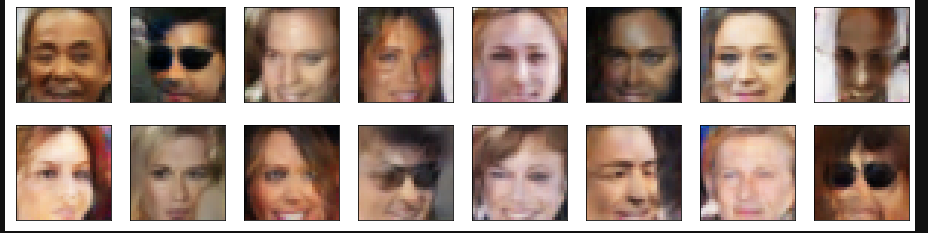

# Fake_Face_Generator
***Generating the Fake Faces using DCGAN and PyTorch***

## About
In this model, the samll set of data from the original data of the Celeb Pics is taken from **[Large-scale CelebFaces Attributes (CelebA) Dataset](http://mmlab.ie.cuhk.edu.hk/projects/CelebA.html)**

**The data which is used for training the model is already preprocessed.**

**Pytorch** is used to create the model

### Images Comparison

**Sample Original Image from the dataset**

**Fake Images Generated by the Model**

### Note

* **The model is trained for only 30 epochs because after 30 epochs my GPU run outs of memory**

